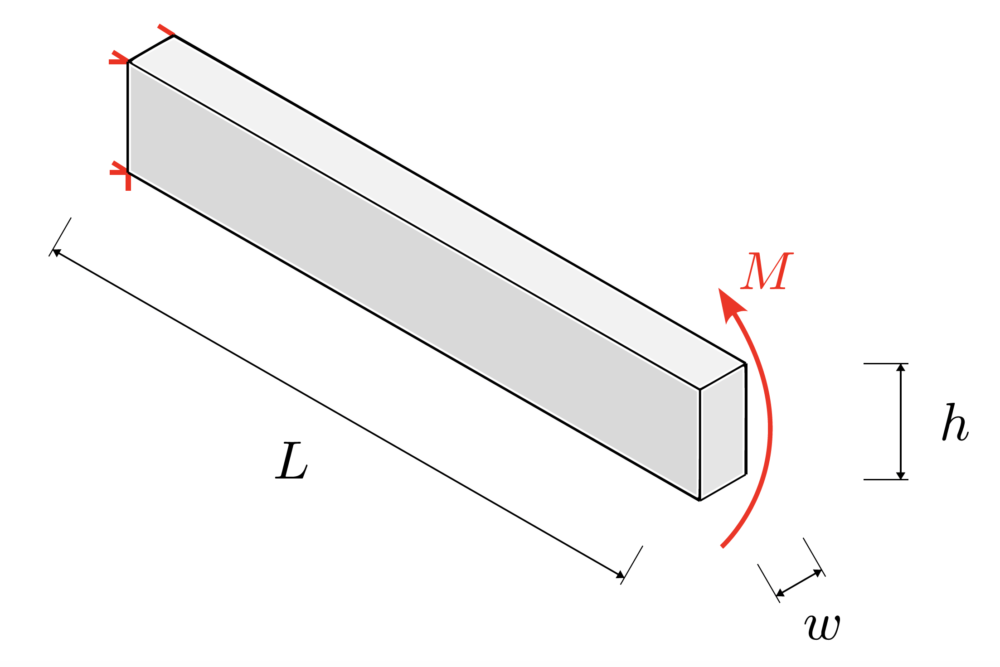
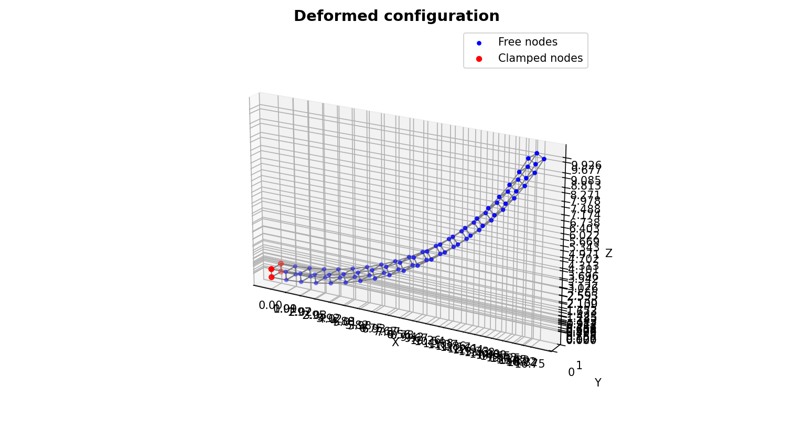
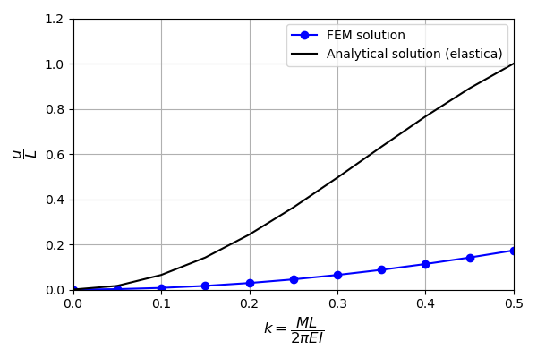
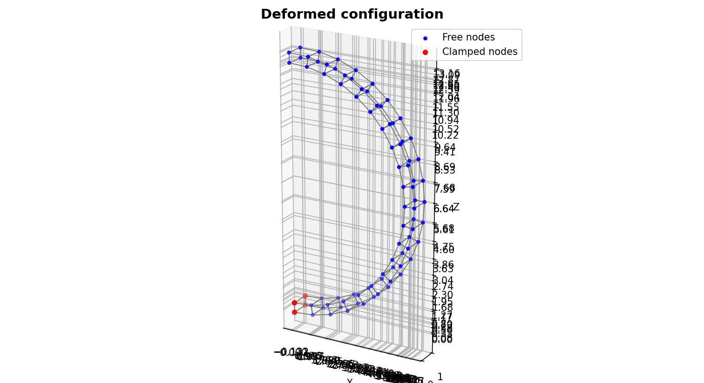
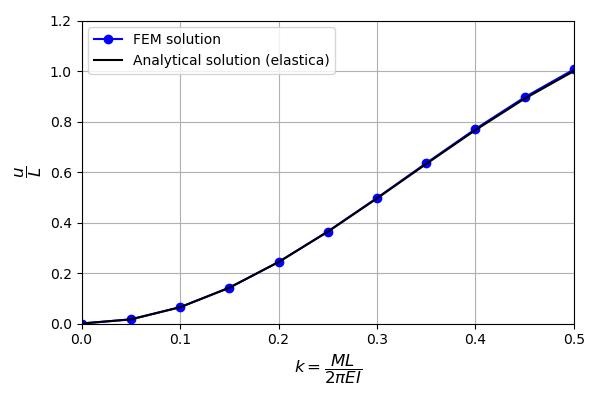
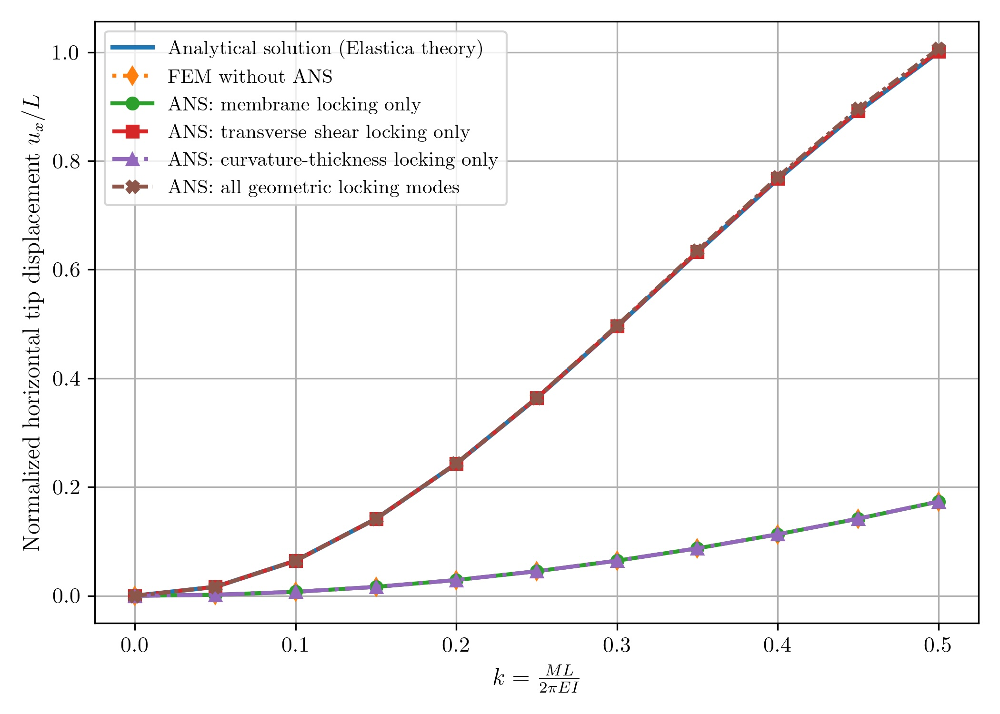
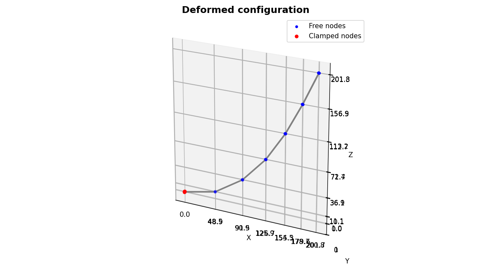
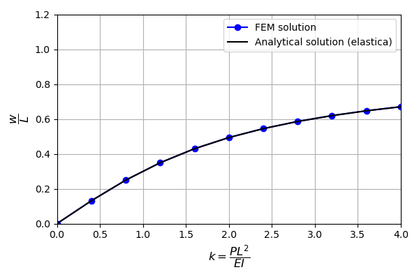

Examples
========

Numerical Example 1
-------------------

The problem we solve here is a rectangular cantilever beam subjected to bending moment applied at its tip.

We simulate the cantilever using the following parameters. The load level is
set to ``k_max = 0.5``, corresponding to an applied bending moment
:math:`M = \pi E I / L`. According to classical elasticity theory, this moment
induces a constant curvature that bends the beam into a half-circle. Initially, we do not activate the locking allevation.

.. code-block:: python

   # =============================================================================
   # Problem setup
   # =============================================================================

   # Geometry (rectangular cross-section)
   width = 1.0       # beam width
   height = 0.5      # beam height
   length = 20.0     # beam length

   # Material (Saint Venant–Kirchhoff)
   E = 1.2e7         # Young's modulus
   nu = 0.0          # Poisson's ratio (nu = 0 avoids volumetric locking)

   # Loading
   load_type = "moment"   # "moment" or "shear"
   k_max = 0.5            # target nondimensional load

   # Discretization
   numel = 20             # elements along beam length
   ne_L = 2               # nodes per element in axial direction (>= 2)

   # Numerical integration
   ngp_c = 2              # Gauss points per cross-sectional direction
   ngp_l = ne_L           # Gauss points along beam length (<= 10)

   # Locking alleviation (Assumed Natural Strain)
   ANS_membrane = False    # membrane locking
   ANS_shear = False       # transverse shear locking
   ANS_curvature = False  # curvature–thickness locking

   # Incremental-iterative solver
   n_load_steps = 10      # load increments
   max_iterations = 20   # Newton–Raphson iterations per step
   tolerance = 1e-15     # convergence tolerance on energy norm

   # Visualization
   visualize_reference = True   # visualize reference configuration
   visualize_final = True       # visualize final configuration
   plot_displacement = True     # plot normalized tip displacement

The solution is obviously locked.

Now, we activate the locking alleviation techniques

.. code-block:: python

   # Locking alleviation (Assumed Natural Strain)
   ANS_membrane = True    # membrane locking
   ANS_shear = True       # transverse shear locking
   ANS_curvature = True  # curvature–thickness locking

The solution now is in excellent agreement with analytical solution.

The influence of the different locking modes can be assessed by selectively
activating the corresponding alleviation mechanisms. For this problem, the
response is dominated by transverse shear locking.

Nuemrical Example 2
-------------------

We simulate a cantilever beam subjected to conservative shear loading using the following parameters. The load level is
set to ``k_max = 4.0``, corresponding to an applied force
:math:`F =  4 EI  / L^2`.

.. code-block:: python

   # =============================================================================
   # Problem setup
   # =============================================================================

   # Geometry (rectangular cross-section)
   width = 1.0       # beam width
   height = 1.0      # beam height
   length = 300.0     # beam length

   # Material (Saint Venant–Kirchhoff)
   E = 12         # Young's modulus
   nu = 0.0          # Poisson's ratio (nu = 0 avoids volumetric locking)

   # Loading
   load_type = "shear"   # "moment" or "shear"
   k_max = 4.0            # target nondimensional load

   # Discretization
   numel = 3             # elements along beam length
   ne_L = 3               # nodes per element in axial direction (>= 2)

   # Numerical integration
   ngp_c = 2              # Gauss points per cross-sectional direction
   ngp_l = ne_L           # Gauss points along beam length (<= 10)

   # Locking alleviation (Assumed Natural Strain)
   ANS_membrane = True    # membrane locking
   ANS_shear = True       # transverse shear locking
   ANS_curvature = True  # curvature–thickness locking

   # Incremental-iterative solver
   n_load_steps = 10      # load increments
   max_iterations = 20   # Newton–Raphson iterations per step
   tolerance = 1e-15     # convergence tolerance on energy norm

   # Visualization
   visualize_reference = True   # visualize reference configuration
   visualize_final = True       # visualize final configuration
   plot_displacement = True     # plot normalized tip displacement

After activating locking alleviation, the solution is in excellent agreement with analytical solution.

Similar to above, the influence of the different locking modes can be assessed by selectively
activating the corresponding alleviation mechanisms. For this problem, the
response is dominated by membrane locking, with some transverse shear and curvature-thickness locking.

.. figure:: images/comparison_ex2.png
   :width: 80%
   :align: center
   :alt: Locking modes comparison for example 2

Notes
-----

The parameters used in the above simulations are chosen to match those reported
in the following references:

.. [Frischkorn2013]
   J. Frischkorn and S. Reese,
   *A solid-beam finite element and non-linear constitutive modelling*,
   Computer Methods in Applied Mechanics and Engineering,
   **265**, 195–212 (2013).
   https://doi.org/10.1016/j.cma.2013.06.002

.. [Shafqat2024]
   A. Shafqat, O. Weeger, and B. X. Xu,
   *A robust finite strain isogeometric solid-beam element*,
   Computer Methods in Applied Mechanics and Engineering,
   **426**, 116993 (2024).
   https://doi.org/10.1016/j.cma.2024.116993
