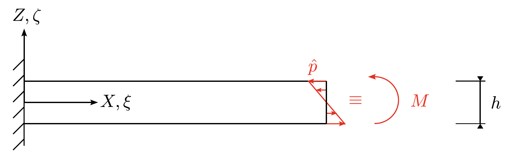

Nonlinear Finite Element Procedure
=========

We work in convective curvilinear coordinates, and while we follow the
general framework presented in Nonlinear Finite Element Methods by
Wriggers (2008), several steps are modified to suit this coordinate system.
Only the key results and necessary adjustments are summarized here.
We assume the reader is familiar with the general procedure and provide
only brief reminders.

The weak form of the problem, neglecting inertial effects and body
forces, is given by

.. math::

   \int_{\Omega_0} \mathbf{S} : \delta \mathbf{E} \, \mathrm{d}V
   -
   \int_{\partial \Omega_0} \mathbf{t}_0 \cdot \delta \mathbf{x} \, \mathrm{d}A
   = 0,

where:

- :math:`\mathbf{S}` is the second Piola–Kirchhoff stress tensor
- :math:`\mathbf{t}_0` is the surface traction in the reference configuration

Equivalently, one may write

.. math::

   g(\mathbf{x}, \delta \mathbf{x})
   =
   g^{\mathrm{int}}(\mathbf{x}, \delta \mathbf{x})
   -
   g^{\mathrm{ext}}(\mathbf{x}, \delta \mathbf{x})
   = 0,

with

.. math::

   g^{\mathrm{int}}(\mathbf{x}, \delta \mathbf{x})
   :=
   \int_{\Omega_0} \mathbf{S} : \delta \mathbf{E} \, \mathrm{d}V,

.. math::

   g^{\mathrm{ext}}(\mathbf{x}, \delta \mathbf{x})
   :=
   \int_{\partial \Omega_0} \mathbf{t}_0 \cdot \delta \mathbf{x} \, \mathrm{d}A.

The linearization of the internal virtual work is given by

.. math::

   \Delta g^{\mathrm{int}}
   =
   \int_{\Omega_0}
   \Delta \mathbf{E} : \mathbb{C}(\mathbf{E}) : \delta \mathbf{E} \, \mathrm{d}V
   +
   \int_{\Omega_0}
   \mathbf{S} : \Delta \delta \mathbf{E} \, \mathrm{d}V,

where:

- :math:`\int_{\Omega_0} \Delta \mathbf{E} : \mathbb{C}(\mathbf{E}) : \delta \mathbf{E} \, \mathrm{d}V`
  is the material contribution
- :math:`\int_{\Omega_0} \mathbf{S} : \Delta \delta \mathbf{E} \, \mathrm{d}V`
  is the geometric contribution

The linearization of the external virtual work vanishes when the applied
load is conservative. However, for non-conservative loads (e.g. follower
loads), the linearization is generally non-zero and must be taken into account.
This leads to the following consequences:

- The load must be updated during every Newton–Raphson iteration
  to remain consistent.
- An additional (third) contribution to the tangent matrix must be added,
  but only for elements that are directly loaded. As a result, the tangent
  matrix is no longer symmetric.

For details on the linearization of the external virtual work, see
Wriggers (2008), Section 4.2.5. The procedure followed here is exactly as
outlined therein.

In this work, a bending moment acting at the tip of the beam is modeled
as a follower load, defined as

.. math::

   \hat{p}
   =
   -
   \left(
      \frac{12 M}{I}
   \right)
   \zeta,
   \qquad
   \zeta \in \left[ -\frac{h}{2}, \frac{h}{2} \right].

The load is applied as a first Piola–Kirchhoff stress tensor, meaning that
it is defined over the undeformed area. The magnitude of the load remains
constant, while its direction changes with deformation.

   Bending traction applied at the beam tip, modeled as a follower load.
