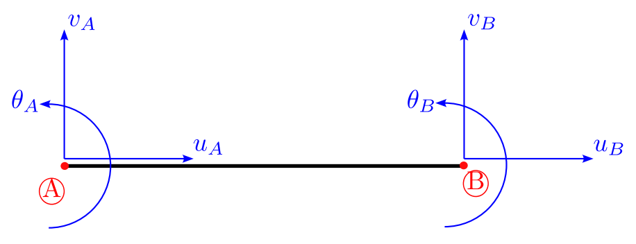
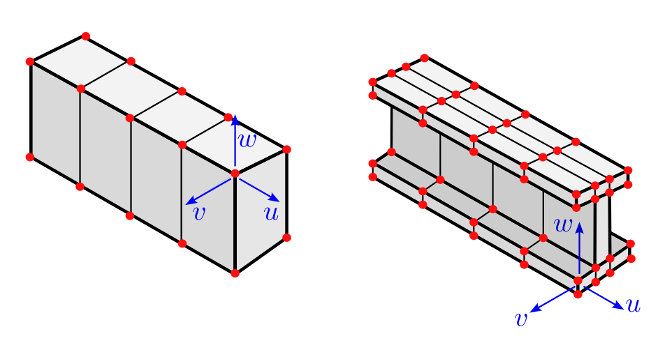
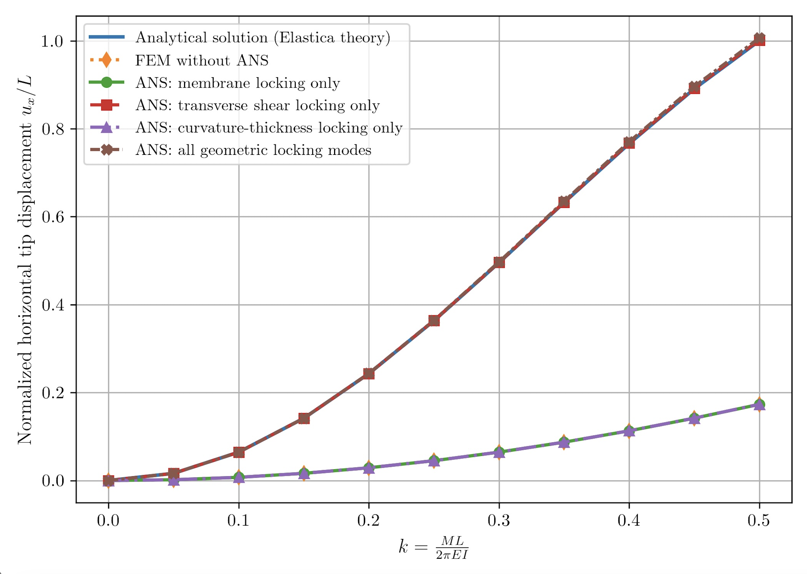
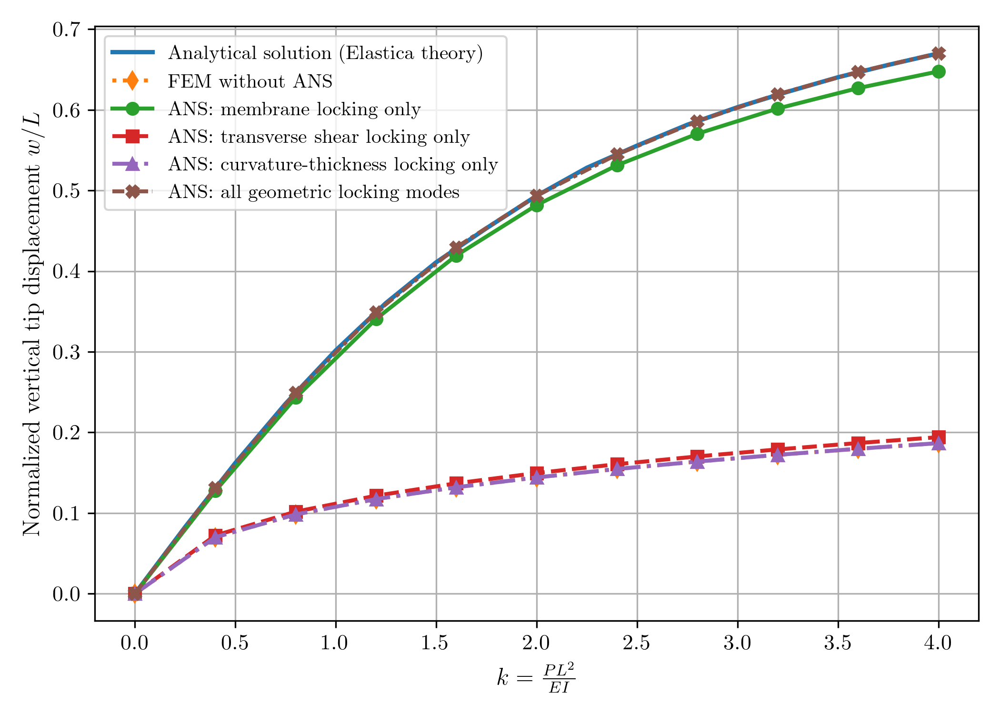

# Summary

Beams are fundamental structural elements in engineering. In finite element analysis, they are typically modeled using one-dimensional elements that incorporate both translational and rotational degrees of freedom. These elements are derived from classical beam theories such as Euler--Bernoulli and Timoshenko [@hughes2003finite]. While computationally efficient, such models cannot capture cross-sectional deformation or complex material behavior, and they present challenges for multiphysics coupling and contact modeling. These limitations arise from the underlying assumptions of the beam theories themselves, rather than from the finite element method.

{ width=50% }

In solidbeamFEM, an alternative approach is adopted: beams are modeled as three-dimensional continua and discretized using brick elements with only translational degrees of freedom. The idea of modeling thin structures using brick elements originated in plate and shell formulations and was later extended to beams [@frischkorn2013solid].

{ width=50% }

The formulation is developed in convected curvilinear coordinates aligned with the beam geometry [@basar2013nonlinear]. This choice provides a clear physical interpretation of strain and stress measures that parallels classical beam theories, facilitating direct comparison with one-dimensional models and enabling systematic application of locking alleviation techniques. The governing equations, weak form, and numerical implementation are documented in the accompanying [ReadTheDocs documentation](https://solidbeamfem.readthedocs.io/en/latest/).

It is desirable to use a minimal number of finite elements across the beam cross-section to achieve computational efficiency. However, when relatively coarse meshes are employed, a well-known pitfall of such formulations is locking  [@wriggers2008nonlinear]—a numerical artifact that results in unrealistically small deformations and excessively high stresses. This behavior reflects an unphysical stiffening of the model and leads to significant deviations from the true mechanical response. solidbeamFEM incorporates techniques that alleviate locking even when relatively coarse discretizations are used.

In general, common locking modes include transverse shear, membrane, curvature--thickness, Poisson, and volumetric locking. In solidbeamFEM, the focus is on geometric locking phenomena. Transverse shear, membrane, and curvature--thickness locking are addressed using the Assumed Natural Strain (ANS) method, which has been shown to be effective for structural problems modeled with brick elements  [@bucalem1993higher; @betsch1995assumed; @frischkorn2013solid]. Our implementation follows the formulation presented in  [@caseiro2014assumed], extended to the geometrically nonlinear regime. Locking modes associated with material behavior, namely Poisson and volumetric locking, are not treated by ANS, thus they are outside the scope of the present work.

# Statement of need

Solid-beam formulations are known to be affected by multiple forms of locking. In this contribution, we consider the geometry-induced modes, which are the ones that can be treated using the Assumed Natural Strain (ANS). In practice, these locking modes may be present simultaneously, and their relative importance depends on the geometry, loading, and numerical discretization.

Although a variety of locking alleviation techniques have been proposed, existing finite element implementations often address multiple locking mechanisms at once, or embed locking control implicitly within specific element formulations. As a result, it can be difficult to disentangle the sources of artificial stiffening, or to assess the effectiveness of different locking alleviation strategies.

solidbeamFEM addresses this limitation by providing a controlled environment in which locking mechanisms can be studied and mitigated in a transparent manner. It offers selectively activatable ANS treatments for transverse shear, membrane, and curvature--thickness locking. Combined with flexible discretization options—including $h$-refinement, $p$-refinement in the axial direction, and explicit control over the number of integration points in each parametric direction, enabling the use of reduced integration rules—the framework facilitates systematic investigation and comparison of individual locking modes and their alleviation strategies.

# Numerical Examples

Two numerical examples are presented to illustrate the ability of solidbeamFEM to isolate and alleviate the different geometric locking modes using selectively activatable ANS treatments. Full problem definitions, discretization details, and some results are available in the accompanying [ReadTheDocs documentation](https://solidbeamfem.readthedocs.io/en/latest/).

The first example considers a cantilever beam bent into half a circle due to a bending moment at its free end. The applied moment is modeled as a linearly distributed follower traction acting on the end cross-section, ensuring consistency with nonlinear kinematics. This configuration represents a pure bending problem and is dominated by transverse shear locking when standard displacement-based brick elements are used.

{ width=85% }

The second example examines a cantilever beam subjected to a conservative transverse shear loading. Under sufficiently large loading, this problem involves pronounced membrane locking. Minor contributions from transverse shear and curvature-thickness locking are also present.

{ width=85% }

In both examples, numerical results are shown to be in agreement with analytical solutions as well as with previously published finite element formulations. These examples illustrate how solidbeamFEM enables systematic investigation of individual geometric locking mechanisms and their alleviation within a unified solid-beam framework.

# References
